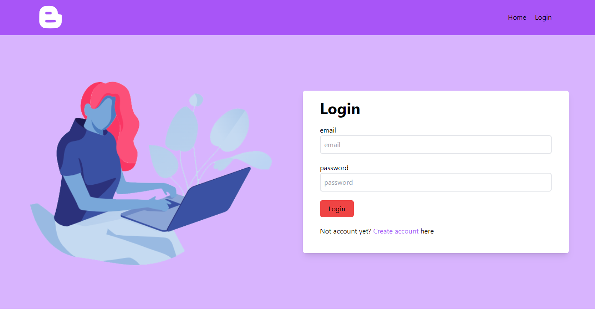
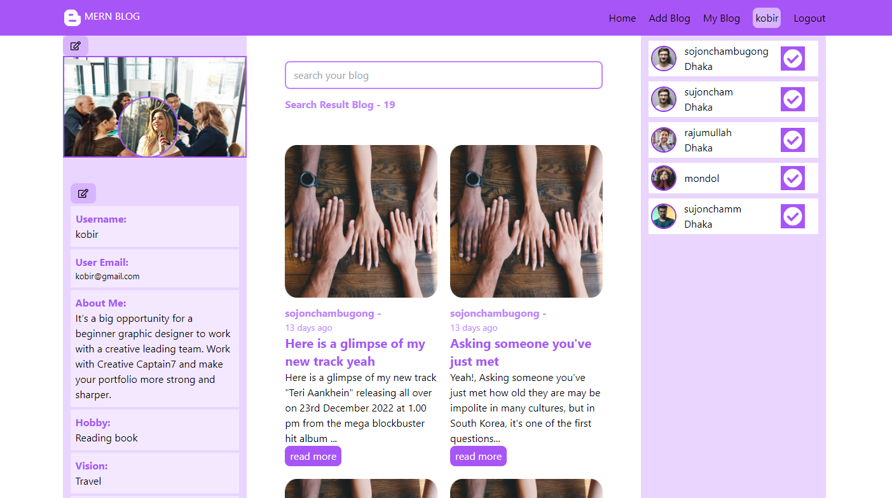
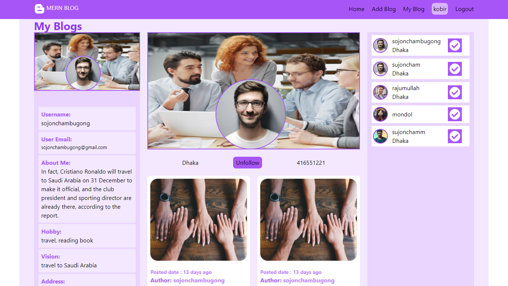

# MERN FULL STACK- Mern Blog

#### Live Project: (https://mern-blog-client.onrender.com/)

#### Live Project: (https://mern-blog-pro.netlify.app/)

##### Server Git Link: (https://github.com/sujoncham/mern-blog-server.git)

## Name of Project

- Mern Blog
- reactjs, Nodejs, ExpressJs, mongodb, mongoose based
- Language : Javascript
- Server: NodeJs
- Database: mongodb atlas

## User Home Page

## User Profile Page

## Technologies used in Blog

- github
- vscode

## Packages used in Blog front end development

- reactjs
- tailwindcss
- react-icons
- react-router-dom
- toastify
- axios
- reactQuery

## Packages used in Blog back end development

- cors
- dotenv
- nodemon
- multer
- nodejs
- expressjs
- mongodb-atlas
- mongoose

## Authenticate this Blog

- password hashing by bcrypt
- jwt use for token
- login by user id from localstorage

## How to use this Blog

- if clone this site, first - npm install(front-end and backend)
- first, register
- then, login
- update your profile
- write blog
- indivisual blog
- can read details blog
- can comment about the blog
- mongoose mvc pattern in backend part

## requirements pending this Blog

- user likes - done
- category adding
- email verification
- google login system
- profile image adding - done

### Primarily Deploy this project

- server-side deploy in render.com
- client-side deploy in render.com/netlify.com

*
*
*
*
*

### Still running this project **\*\*\***\*\*
