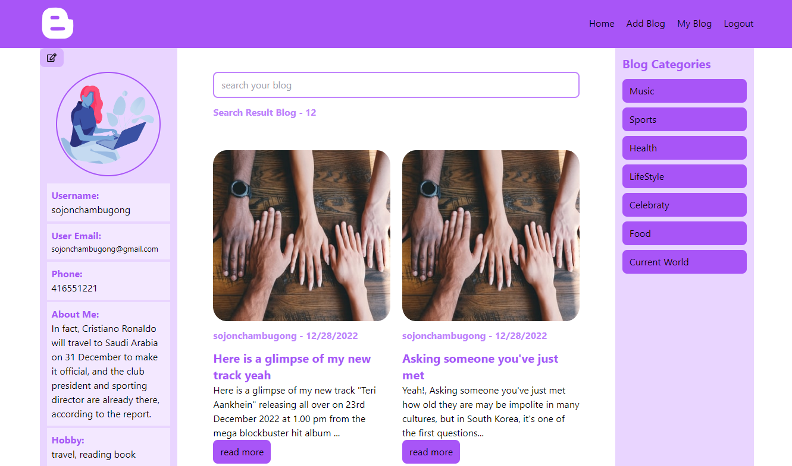

# MERN FULL STACK- Mern Blog

#### Live Project: (https://mern-blog-client.onrender.com/)

##### Server Git Link: (https://github.com/sujoncham/mern-blog-server.git)

## Name of Project

- Mern Blog
- reactsj, Nodejs, mongodb based
- Language : Javascript

## Home Page

## Technology used in Blog

- reactjs
- tailwindcss
- nodejs
- expressjs
- mongodb-atlas
- mongoose
- github
- vscode

## Packages used in Blog front end development

- react-icons
- react-router-dom
- toastify
- axios

## Packages used in Blog back end development

- cors
- dotenv
- nodemon
- multer

## Authenticate this Blog

- password hashing by bcrypt
- jwt use for token
- login by user id from localstorage

## How to use this Blog

- first, register
- then, login
- update your profile
- write blog
- indivisual blog
- can read details blog
- can comment about the blog
- mongoose mvc pattern in backend part

## requirements pending this Blog

- user likes
- category adding
- email verification
- google login system
- profile image adding

### Primarily Deploy this project

- server-side deploy in render.com
- client-side deploy in render.com

*
*
*
*
*

### Still running this project **\*\*\***\*\*
